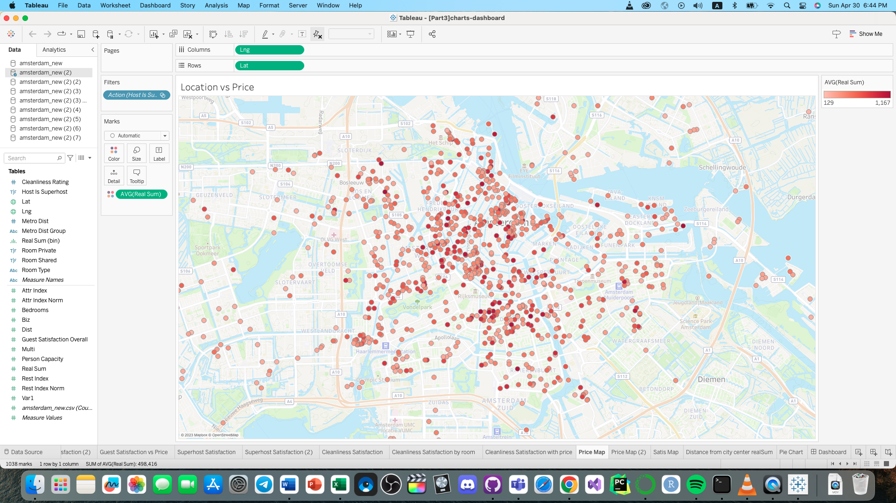

# In-Depth Analysis of Amsterdam Airbnb Listings: Uncovering Insights for Optimizing Pricing and Demand.
Analyzed Airbnb listings in Amsterdam using Tableau to identify factors affecting pricing and demand. Utilized data visualization and statistical techniques to uncover insights related to location, amenities, and host characteristics. Results can inform strategies for optimizing listings and maximizing revenue for hosts.

